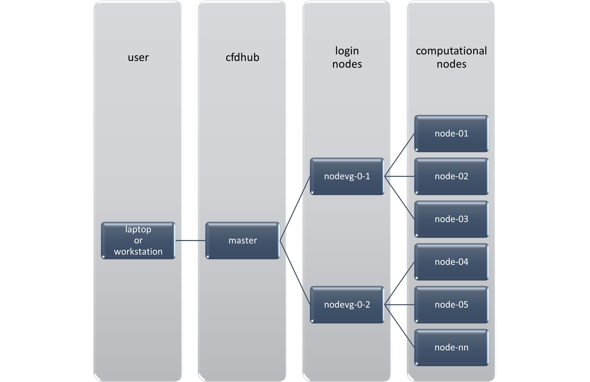
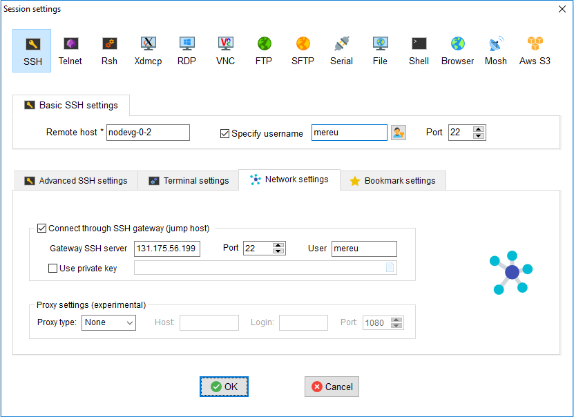
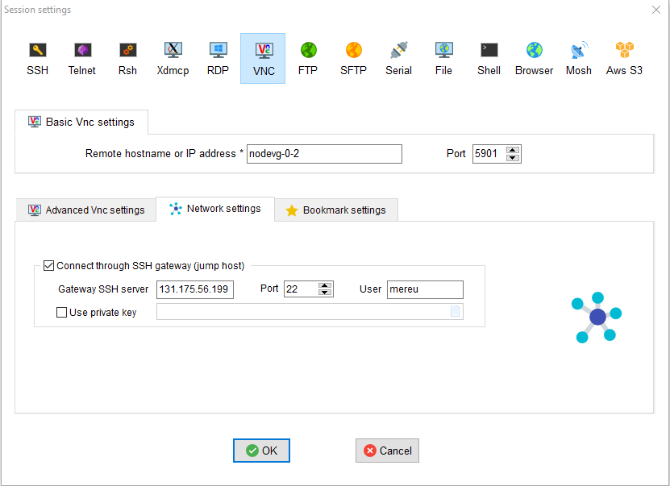
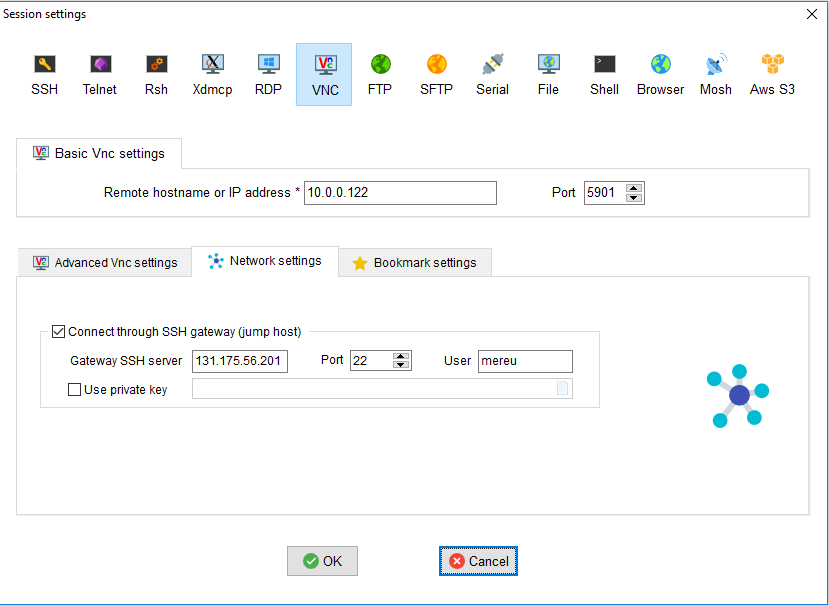

.. _AccessToTheCluster:

=====================
ACCESS TO THE CLUSTER
=====================

This section describes how to install and set-up the programs needed to connect your terminal (workstation or laptop) to the cluster.

The cluster environment is Linux OS. If you need some information on how to work in a Linux environment you may check the `Ubuntu Help <https://help.ubuntu.com/community/UsingTheTerminal>`_ or a `UNIX Tutorial <http://www.ee.surrey.ac.uk/Teaching/Unix/index.html>`_.

The master is the machine that manages all the communications between the cluster resources and the login nodes. Login nodes (*nodevg-0-x*) are the nodes used to manage the interaction between users and graphical parts and the computing nodes. When you log into the cluster you actually log into the master and then to the login nodes.

Figure: CFDHub hardware structure for user access.

In order to use the computing resources you will have to log into nodevg-0-1 or nodevg-0-2 (dependng on your :ref:`Research Group<ResearchGroups>`) to successively use the computational resources. 

| *Remember:*
| **Never launch a computational run from the master!**
| **Always check to be connected to the selected computing nodes before to launch the run!**
| **All the processes running on the master or the login nodes will be killed without any advice if affecting the functionality of the whole system.**

-----------------
REQUIREMENTS 
-----------------

Three ways exist to access the CFDHub HPC: 

- directly from PoliMi network; 
- from VPN service; 
- from tunnelling service. 

The latter two methods are used when you are *outside* PoliMi network. Specifically, the access through tunnelling machine must be request and is activated only for users without the opportunity to get a VPN access from his/her own Department. 

-----------------------
VPN SERVICE ACTIVATION 
-----------------------

To access the CFDHub HPC machines from outside PoliMi, you are required to ask your own Department IT staff the activation of VPN service for your PoliMi account. Some indications about what it is and how it works are reported at https://www.asict.polimi.it/en/network-services/vpn.html 

--------------------
TUNNELLING SERVICE 
--------------------

For whom is not able to get the VPN access (e.g. master thesis students) the access will be provided by using a tunnelling approach. 

This kind of access needs to be activated by the technical manager of the CFDHub and should be indicated when the access for new users is required. 

----------------------
STEPS FOR HPC ACCESS 
----------------------

If you access the cluster from a Linux OS, you can directly jump to the :ref:`SSH connection instructions<SSHConnection>`.

If you are accessing from a non-Linux OS, the steps to access the HPC machines (through both VPN service and tunnelling machine) are: 

- :ref:`installation of the software to access the cluster<AccessSoftwareInstallation>`; 

- :ref:`setting of SSH session to access the cluster<DetailedSSHConnection>`; 

- :ref:`creation of the graphical port for remote control of the cluster and use of VNC tool<GraphicalPort>`; 

- :ref:`setting of a VNC session to graphically access and control the HPC machines<VNCSession>`;

- :ref:`settings to upload and download files to/from HPC machines to the local one<DataTransferring>`. 

.. _AccessSoftwareInstallation:

-----------------------------
ACCESS SOFTWARE INSTALLATION 
-----------------------------

Download and install the software MobaXterm_.

.. _MobaXterm: https://mobaxterm.mobatek.net/download.html 

Possible quick solution is Putty_.

.. _Putty: https://www.chiark.greenend.org.uk/~sgtatham/putty/latest.html 

.. _SSHConnection:

---------------------
SSH CONNECTION 
---------------------

Connect to SSH server *131.175.56.199* through Port *22*.
To start working on the cluster, it is necessary also to connect to the login nodes *nodevg-0-1* or *nodevg-0-2*, depending on your :ref:`Research Group<ResearchGroups>`.

.. _ResearchGroups:

- nodevg-0-1 (*10.0.0.121*)          Research groups of Chemical, Mathematical and Mechanical Engineering Departments;
- nodevg-0-2 (*10.0.0.122*)          Research groups of Energy, Electronic-BioEngineering and not mentioned Departments.

For Linux users the command to access the CFDHub is:

        ``ssh <username>@131.175.56.199``
        
then to access your login node you may choose 

        ``ssh nodevg-0-x`` or ``ssh 10.0.0.12x``

where *x = 1,2* depending on your :ref:`Research Group<ResearchGroups>`.

Detailed information for non Linux OS is available in the following section.

.. _DetailedSSHConnection:

__________________________________
DETAILED SSH CONNECTION SETTINGS
__________________________________

1. Open the software and go to *Sessions* Tab --> *New Session* --> choose *SSH* and open the *Session setting* panel

2. Set up the SSH session as described in Figure for **connection through VPN**. Use your ``<username>`` instead of *mereu* and *nodevg-0-x* instead of *nodevg-0-2*, where *x = 1,2* based on your :ref:`Research Group<ResearchGroups>`

3. Set up the SSH session as described in Figure for **connection through tunnelling machine**. Use your ``<username>`` instead of *mereu* and *10.0.0.12x* instead of *10.0.0.122*, where *x = 1,2* based on your :ref:`Research Group<ResearchGroups>`

4. Click OK to save the session

.. _GraphicalPort:

------------------------------
CREATION OF A GRAPHICAL PORT
------------------------------

5. Open the SSH session created in the previous steps;

6. In the SSH terminal digit:

	``vncserver -name <username>  -geometry 0000X0000 -depth 24``
	
   where ``0000x0000`` is the resolution of the monitor you use to work
   
   for example ``vncserver -name mereu -geometry 1920x1080 -depth 24``

7. The graphical port assigned to you is indicated by the system:
   
   | for example
   | ``Desktop TurboVNC: nodevg-0-2.local:01 (mereu) started on display nodevg-0-2.local:01``
   
   means that the graphical port assigned is *01*.

.. _VNCSession:

------------------------------
SETTING OF VNC SESSION
------------------------------

8. Open the software and go to *Sessions* Tab --> *New Session* --> choose *VNC* and open the *Session setting* panel;

9. Set up the VNC session as described in Figure for **connection through VPN**. Use your ``<username>`` instead of *mereu* and *nodevg-0-x* instead of *nodevg-0-2*, where *x = 1,2* based on your :ref:`Research Group<ResearchGroups>`, and the port number provided by the system in step 7 putting in front the number *59* (e.g. if the assigned port is 35 put 5935 instead of 5901);

10. Set up the VNC session as described in Figure for **connection through tunnelling machine**. Use your ``<username>`` instead of *mereu* and *10.0.0.12x* instead of *10.0.0.122*, where *x = 1,2* based on your :ref:`Research Group<ResearchGroups>`, and the port number provided by the system in step 7 putting in front the number *59* (e.g. if the assigned port is 35 put 5935 instead of 5901);

11. Click OK to save the session 

.. _DataTransferring:

-----------------
DATA TRANSFERRING 
-----------------

In order to transfer files from your terminal to the cluster and vice versa, you may use the ``scp`` command from Linus OS.

    ``scp <sourceDir> <targetDir>``
    
    | ``scp <localFile> <username>@131.175.56.199:<remoteDirectory>``
    | ``scp <username>@131.175.56.199:<remoteFile> <localDirectory>``
    | ``scp -r <localDirectory> <username>@131.175.56.199:<remoteDirectory>``
    | ``scp -r <username>@131.175.56.199:<remoteDirectory> <localDirectory>``

For all other OS you may use the FTP software Filezilla_ can be used.

.. _Filezilla: https://filezilla-project.org/download.php

__________________________________
TUNNELLING SETUP
__________________________________

To transfer data within MobaXterm software follow the instructions.

1. In MobaxTerm open *tools* and then *MobaSSHTunnel (port forwarding)* 

2. Create a local port forwarding (New SSH Tunnel) with the set-up indicated in the image below. Use your ``<username>`` instead of *mereu* and *10.0.0.12x* instead of *10.0.0.122*, where *x = 1,2* based on your :ref:`Research Group<ResearchGroups>`;

.. image:: images/DataTransferTunnel.png

3. Open tab *Tunnelling* and run the symbol play in *MobaSSHTunnel (port forwarding)*

4. Open Filezilla or session *SFTP* in MobaXterm and insert host *127.0.0.1*, your ``<username>``, your ``<password>`` and port *22*. 

Once you inserted your user data and accessed to the cluster, you will see in the left side your terminal and in the right side the cluster folders (``/home/energia/mereu`` in the example above).  

To transfer (copy) data just drag files from one side to the other.

